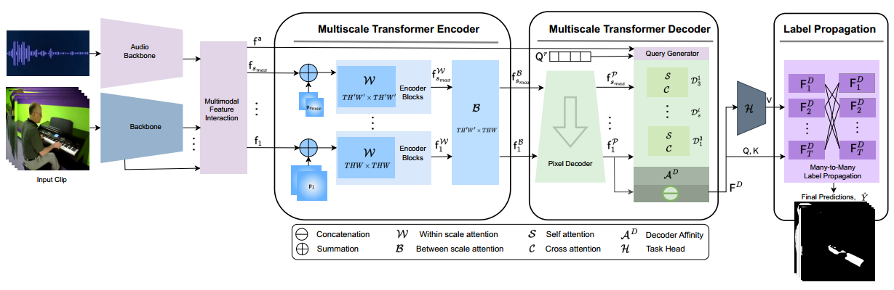

## PyTorch implementation of "MED-VT/MEDVT++: A Unified Multiscale Encoder-Decoder Transformer for Video Segmentation" 
[Project](https://rkyuca.github.io/medvt/) - [MED-VT Paper](https://openaccess.thecvf.com/content/CVPR2023/papers/Karim_MED-VT_Multiscale_Encoder-Decoder_Video_Transformer_With_Application_To_Object_Segmentation_CVPR_2023_paper.pdf) - [Supplement](https://openaccess.thecvf.com/content/CVPR2023/supplemental/Karim_MED-VT_Multiscale_Encoder-Decoder_CVPR_2023_supplemental.pdf) - [MED-VT++ paper](https://arxiv.org/abs/2304.05930)
<hr>

* Update: This repository is archived now and no longer actively maintained.

# Abstract
We present an end-to-end trainable unified multiscale encoder-decoder transformer that is focused on dense prediction tasks in video. The presented Multiscale Encoder-Decoder Video Transformer (MED-VT) uses multiscale representation throughout and employs an optional input beyond video (e.g., audio), when available, for multimodal processing (MED-VT++). Multiscale representation at both encoder and decoder yields three key benefits: (i) implicit extraction of spatiotemporal features at different levels of abstraction for capturing dynamics without reliance on input optical flow, (ii) temporal consistency at encoding and (iii) coarse-to-fine detection for high-level (e.g., object) semantics to guide precise localization at decoding. Moreover, we present a transductive learning scheme through many-to-many label propagation to provide temporally consistent video predictions. We showcase MED-VT/MED-VT++ on three unimodal video segmentation tasks (Automatic Video Object Segmentation (AVOS), actor-action segmentation and Video Semantic Segmentation (VSS)) as well as a multimodal segmentation task (Audio-Visual Segmentation (AVS)). Results show that the proposed architecture outperforms alternative state-of-the-art approaches on multiple benchmarks using only video (and optional audio) as input, without reliance on optical flow. Finally, to document details of the model's internal learned representations, we present a detailed interpretability study, encompassing both quantitative and qualitative analyses.


# Architecture
<p align="center">
  
</p>

<p align="center">
  
</p>

Detailed (MED-VT) architecture with unified multiscale encoder-decoder transformer, illustrated with application to Automatic Video Object Segmentation (AVOS). The model has four functionally distinct components. (i) Backbone feature extractor to extract per frame features at multiple scales. (ii) Multiscale transformer encoder consisting of spatiotemporal within and between scale attention with resulting features; the multihead attention transformation is used for both. (iii) Multiscale transformer decoder consisting of pixel decoding, which produces decoded features and a series of mulitscale query learning decoder blocks, that iterate across scales, each of which entail self and cross attention. The input to the blocks are the decoded features and the query resulting from the previous block; the output is a final object query. The decoder applies an affinity between the learned query and the finest scale decoded features to yield an object attention map, which is concatenated with the finest scale decoded features for final decoder output (iv) A many-to-many label propagation and a shallow (three layer) 3D-CNN module that inputs decoder features to produce temporally consistent segmentation masks. The many-to-many label propagation module uses masked attention. The mask can be defined to promote communication between data points in a wide variety of fashions (e.g within frame, between frames, many-to-one, many-to-many). We use this mechanism for temporal many-to-many propagation to encourage information sharing among different frames. Additionally, we explore theoretical connections between our label propagation approach and spectral clustering. MED-VT++ adds three additional components: An additional backbone to extract auxiliary (e.g. audio) features, a Multimodal feature interaction that uses bidirectional cross-attention, and a Multimodal query generator that initializes the query from additional modality feature output from the feature fusion module (e.g., audio feature) instead of random initialization used for unimodal segmentation.

# Installation


## Environment Setup
The experiments were done on Ubuntu 18.04 with python 3 using anaconda environment. Here is details on how to set up the conda environment.
(If you do not have anaconda 3 installed, first do it following the set up instruction from [here](https://www.anaconda.com/products/distribution)) 

* Create conda environment:
 
  ```create environment
  conda create -n medvt python=3
  source ~/.bashrc
  conda activate medvt
  ```

* Install PyTorch from [here](https://pytorch.org/get-started/locally/). 


* Install other requirements:

  ```setup
  pip install -r requirements.txt
  ```
 
* Install pydensecrf (If you use CRF postprocessing)

  ```setup
  pip install git+https://github.com/lucasb-eyer/pydensecrf.git
  ```


## Datasets
For AVOS, we have used Davis 2016 and YouTube-VOS during training. In addition to Davis 2016, we also evaluated the same trained model in YouTube Objects
and MoCA datasets. For actor-action segmentation, we trained and evaluated on A2D dataset. For Video Semantic Segmentation, we used VSPW dataset. For audio-visual sound source segmentation, we used AVSBench dataset. 

Download the datasets following the corresponding paper/project page and update dataset paths in 'datasets/path_config.py'. 
Here is the list of datasets used. 

- [DAVIS16](https://davischallenge.org/davis2016/code.html)
- [MoCA](https://www.robots.ox.ac.uk/~vgg/data/MoCA/)
- [Youtube-Objects](https://data.vision.ee.ethz.ch/cvl/youtube-objects/)
- [A2D](https://web.eecs.umich.edu/~jjcorso/r/a2d/) 
- [VSPW](https://github.com/sssdddwww2/CVPR2021_VSPW_Implement)
- [AVSBench](https://opennlplab.github.io/AVSBench/)

## Download Pretrained Models 
Pretrained backbones, e.g., ResNet, SwinB, SwinL, PVTv2 and VGGish, can be downloaded from their corresponding repository. For convenience to have all in one place, 
we have placed some pretrained backbones in a [Google Drive Folder](https://drive.google.com/drive/folders/1aw_IludWqjh51PUK2tTvjkY8Fc0dNjFW?usp=drive_link). 

We have also shared our pretrained MED-VT checkpoints in a [Google Drive Folder](https://drive.google.com/drive/folders/136vuGSEK6rhT-h1Vtv7A82psaDfveTas?usp=drive_link). If you are interested in evaluating only, you can download and run inference on the MED-VT checkpoints. The links to checkpoints for individual tasks are also provides in the results table.   


# Tasks 
*** 

## Automatic Video Object Segmentation (DAVIS'16, MoCA, YouTube-Objects)
> The models were trained and tested using a single NVIDIA Quadro P6000 24GB GPU.  
> The best checkpoint for automatic video object segmentation is selected based on Davis 2016 dataset. 
> For this reason, the results on MoCA and YouTube-Objects can be slightly different across different trainings. 
> Overall, the results in all datasets using this code are better than the ones reported in the paper. 
> If you find any bugs, which may arise while cleaning up our working codebase to create this repository, 
> please consider reporting an issue. We will do our best effort to respond as soon as possible.      

We provide example command for training and testing using Swin backbone. For training/testing with ResNet backbone is similar with the change of the backbone argument as '--backbone resnet101'.  

### Train

* Train MED-VT with Swin backbone on Davis 2016:
  ```
  python train_swin_medvt_avos.py 
  ```

### Inference on DAVIS'16
* inference:
    ```
        python inference_swin_medvt_avos.py  --model_path ./ckpts/swin_medvt/swin_medvt.pth  --dataset davis --val_size 473 --flip --msc  --output_dir ./outputs/swin_medvt/davis
    ```
    Expected miou: 85.9

* CRF:
  ```
   python crf_davis16.py path/to/logits/from/previous/step  save 
  ```
  Expected miou: 86.6 

> To evaluate using DAVIS toolkit, we followed [this repository](https://github.com/MSiam/davis-2017). While we attempted our best effort to replicate the DAVIS evaluation protocol, we noticed that the evaluation from DAVIS toolkit gives +0.01 in mean iou, e.g., 86.7. 

### Inference on YouTube Objects:
* Use model trained with 6 frames long clips and input size 360px 
    ```
        python inference_swin_medvt_avos.py  --model_path ./ckpts/swin_medvt/swin_medvt.pth  --dataset ytbo --val_size 360 --flip --msc --output_dir ./outputs/swin_medvt/ytbo  
    ```

### Inference on MoCA:
* Use model trained with 6 frames long clips: 
    ```
        python inference_swin_medvt_avos.py  --model_path ./ckpts/swin_medvt/swin_medvt.pth  --dataset moca --val_size 473 --flip  --output_dir ./outputs/swin_medvt/moca   
    ```

#### Results on AVOS
| Backbone   | Frames | Checkpoint                                                                                         | Davis 2016 <br/>(without / with-CRF) | YouTube Objects | MoCA |
|------------|--------|----------------------------------------------------------------------------------------------------|--------------------------------------|-----------------|------|
| Swin-B     | 6      | [swin_medvt](https://drive.google.com/file/d/1NWLWZ1Vkt17Stl-AMZ4qSRnmRaipFvxX/view?usp=sharing)   | 85.9/86.6                            | 79.3            | 78.5 |


## Actor-Action Segmentation (A2D)
We provide example command for training and testing using Swin backbone. For training/testing with ResNet backbone is similar with the change of the backbone argument as '--backbone resnet101'.  

* Train MED-VT with SwinB backbone on A2D:
  ```
  python actor_action/train_medvt_a2d.py --backbone swinB  --output_dir ./outputs/ --lprop_mode 0
  ```

* Inference of MED-VT with SwinB backbone on A2D:
  ```
  python actor_action/inference_medvt_a2d.py --backbone swinB --model_path /path/to/a2d/checkpoint/model.pth --output_dir ./outputs/ --lprop_mode 0
  ```

#### Results on Actor-Action Segmentation
| Backbone  | Checkpoint                                                                                          | A2D  | 
|-----------|-----------------------------------------------------------------------------------------------------|------|
| ResNet101 | [checkpoint](https://drive.google.com/file/d/1RbJ8vX4Z12vD4F4-HtXOf9jPXORKHgBL/view?usp=drive_link) | 45.7 |
| SwinB     | [checkpoint](https://drive.google.com/file/d/1jED-EmRQ7nn1tOqua7q1Q-r6VWiQBUP1/view?usp=drive_link) | 57.3 |
   


## Audio-Visual Segmentation (AVSBench)
The implementation of MED-VT for AVS task on AVSBench dataset extends from the [AVSBench repository](https://github.com/OpenNLPLab/AVSBench). Our sincere gratitude to the authors for making their code public. Other than using the MED-VT model for AVS, we mostly followed their training and inference protocol.
* Training MED-VT with PVT backbone on AVSBench S4 dataset: 
```
python avs/avs_scripts/avs_s4/train_medvt.py 
```

* Inference of MED-VT with PVT backbone on AVSBench S4 dataset: 
```
python avs/avs_scripts/avs_s4/test_medvt.py   --tpavi_va_flag --save_pred_mask --weights /path/to/avs_s4_pvt_medvt.pth
```

* Training MED-VT with PVT backbone on AVSBench MS3 dataset: 
```
  python  avs/avs_scripts/avs_ms3/train_medvt.py  --tpavi_va_flag --masked_av_flag  --masked_av_stages 0 1 2 3  --kl_flag --load_s4_params --trained_s4_model_path /path/to/avs_s4_model.pth
```

* Inference of MED-VT with PVT backbone on AVSBench MS3 dataset: 
```
  python avs/avs_scripts/avs_ms3/test_medvt.py --tpavi_va_flag --weights /paths/to/avs_ms3_model.pth  
```

#### Results on AVSBench (S4 and MS3)
| Dataset      | mean IoU | F_Score | Checkpoint                                                                                           | 
|--------------|----------|---------|------------------------------------------------------------------------------------------------------|
| S4           | 83.22    | 90.54   | [checkpoint](https://drive.google.com/file/d/16EC6Tgd0sC05KGhzKo2OJM0b0WBB9ps4/view?usp=drive_link)  |
| AVSBench-MS3 | 66.61    | 75.51   | [checkpoint](https://drive.google.com/file/d/1LHiiyR3SwFt-LkIEQQInTWANBCoqs3_7/view?usp=drive_link)  |
   


# Acknowledgement
We would like to thank the open-source projects with  special thanks to [DETR](https://github.com/facebookresearch/detr), [VisTR](https://github.com/Epiphqny/VisTR), and [AVSBench](https://github.com/OpenNLPLab/AVSBench) for making their code public. Part of the code in our project are collected and modified from several open source repositories.

# Citation
Please consider citing our paper in your publications if the project helps your research. BibTeX reference is as follow.
* [MED-VT in CVPR'23](https://openaccess.thecvf.com/content/CVPR2023/papers/Karim_MED-VT_Multiscale_Encoder-Decoder_Video_Transformer_With_Application_To_Object_Segmentation_CVPR_2023_paper.pdf)
```
@inproceedings{karim2023med,
  title={MED-VT: Multiscale Encoder-Decoder Video Transformer with Application to Object Segmentation},
  author={Karim, Rezaul and Zhao, He and Wildes, Richard P and Siam, Mennatullah},
  booktitle={Proceedings of the IEEE/CVF Conference on Computer Vision and Pattern Recognition},
  pages={6323--6333},
  year={2023}
}
```
<!---
* [MED-VT++ in Arxiv](https://arxiv.org/abs/2304.05930)
-->
