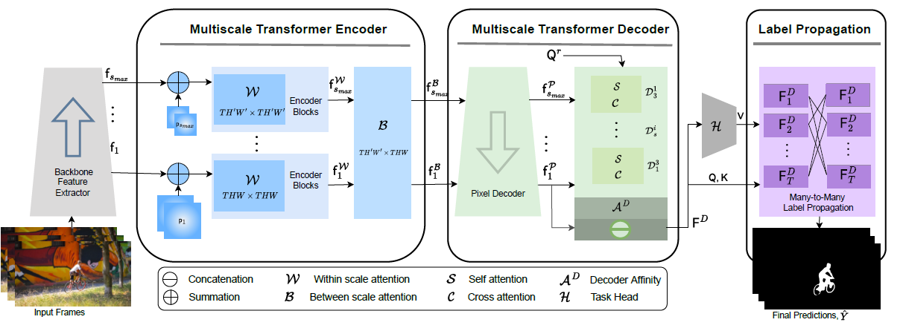

## PyTorch implementation of "MED-VT: Multiscale Encoder-Decoder Video Transformer with Application to Object Segmentation" (CVPR 2023)
[Project](https://rkyuca.github.io/medvt/) - [Paper](https://openaccess.thecvf.com/content/CVPR2023/papers/Karim_MED-VT_Multiscale_Encoder-Decoder_Video_Transformer_With_Application_To_Object_Segmentation_CVPR_2023_paper.pdf) - [Supplement](https://openaccess.thecvf.com/content/CVPR2023/supplemental/Karim_MED-VT_Multiscale_Encoder-Decoder_CVPR_2023_supplemental.pdf)
<hr>


# Abstract
Multiscale video transformers have been explored in a wide variety of vision tasks. To date, however, the multiscale processing has been confined to the encoder or decoder alone. We present a unified multiscale encoder-decoder transformer that is focused on dense prediction tasks in videos. Multiscale representation at both encoder and decoder yields key benefits of implicit extraction of spatiotemporal features (i.e. without reliance on input optical flow) as well as temporal consistency at encoding and coarse-to-fine detection for high-level (e.g. object) semantics to guide precise localization at decoding. Moreover, we propose a transductive learning scheme through many-to-many label propagation to provide temporally consistent predictions. We showcase our Multiscale Encoder-Decoder Video Transformer (MED-VT) on Automatic Video Object Segmentation (AVOS) and actor/action segmentation, where we outperform state-of-the-art approaches on multiple benchmarks using only raw images, without using optical flow.


# Architecture
<p align="center">
  
</p>
Detailed (MED-VT) architecture with unified multiscale encoder-decoder transformer, illustrated with application to Automatic Video Object Segmentation (AVOS). The model has four functionally distinct components. (i) Backbone feature extractor to extract per frame features at multiple scales. (ii) Multiscale transformer encoder consisting of spatiotemporal within and between scale attention with resulting features; the multihead attention transformation is used for both. (iii) Multiscale transformer decoder consisting of pixel decoding, which produces decoded features and a series of mulitscale query learning decoder blocks, that iterate across scales, each of which entail self and cross attention. The input to the blocks are the decoded features and the query resulting from the previous block; the output is a final object query. The decoder applies an affinity between the learned query and the finest scale decoded features to yield an object attention map, which is concatenated with the finest scale decoded features for final decoder output (iv) A many-to-many label propagation and a shallow (three layer) 3D-CNN module that inputs decoder features to produce temporally consistent segmentation masks. The many-to-many label propagation module uses masked attention. The mask can be defined to promote communication between data points in a wide variety of fashions (e.g within frame, between frames, many-to-one, many-to-many). We use this mechanism for temporal many-to-many propagation to encourage information sharing among different frames. Additionally, we explore theoretical connections between our label propagation approach and spectral clustering.

# Installation


## Environment Setup
The experiments were done on Ubuntu 18.04 with python 3 using anaconda environment. Here is details on how to set up the conda environment.
(If you do not have anaconda 3 installed, first do it following the set up instruction from [here](https://www.anaconda.com/products/distribution)) 

* Create conda environment:
 
  ```create environment
  conda create -n medvt python=3
  source ~/.bashrc
  conda activate medvt
  ```

* Install PyTorch from [here](https://pytorch.org/get-started/locally/). 


* Install other requirements:

  ```setup
  pip install -r requirements.txt
  ```
 
* Install pydensecrf (If you use CRF postprocessing)

  ```setup
  pip install git+https://github.com/lucasb-eyer/pydensecrf.git
  ```


## Datasets
For AVOS, we have used Davis 2016 and YouTube-VOS during training. In addition to Davis 2016, we also evaluated the same trained model in YouTube Objects
and MoCA datasets. For actor-action segmentation, we trained and evaluated on A2D dataset. 

Download the datasets following the corresponding paper/project page and update dataset paths in 'datasets/path_config.py'. 
Here is the list of datasets used. 

- [DAVIS16](https://davischallenge.org/davis2016/code.html)
- [MoCA](https://www.robots.ox.ac.uk/~vgg/data/MoCA/)
- [Youtube-Objects](https://data.vision.ee.ethz.ch/cvl/youtube-objects/)
- [A2D](https://web.eecs.umich.edu/~jjcorso/r/a2d/) 

## Download Trained Models 
Pretrained ResNet and Swin backbones can be downloaded from their corresponding repository. For convenience to have all in one place, 
we have placed our used backbone's pretrained weights and trained MED-VT models in a [Google drive folder](https://drive.google.com/drive/folders/1yIXWhSAP-I1WwEzEHzsUkassYWj65Noz?usp=sharing). 
If you are interested in evaluating only, you can download the selected trained med-vt checkpoints from the links in the results table.   


# Inference
## MED-VT with Swin backbone

Below are the steps for inference using Swin backbone. For inference using ResNet backbone, use the same steps with --backbone ResNet.

### MED-VT-Swin inference on Davis 2016:


* inference:
   
    ```
        python -W ignore inference_swin_medvt_avos.py  --model_path ./ckpts/swin_medvt/swin_medvt.pth  --dataset davis --val_size 473 --flip --msc  --output_dir ./outputs/swin_medvt/davis
    ```
    Expected miou: 85.9

* CRF:
  ```
   python crf_davis16.py path/to/logits/from/previous/step  save 
  ```
  Expected miou: 86.5 

  

### Inference on YouTube Objects:
* Use model trained with 6 frames long clips and input size 360px 
    ```
        python -W ignore inference_swin_medvt_avos.py  --model_path ./ckpts/swin_medvt/swin_medvt.pth  --dataset ytbo --val_size 360 --flip --msc --output_dir ./outputs/swin_medvt/ytbo  
    ```

### Inference on MoCA:
* Use model trained with 6 frames long clips: 
    ```
        python -W ignore inference_swin_medvt_avos.py  --model_path ./ckpts/swin_medvt/swin_medvt.pth  --dataset moca --val_size 473 --flip  --output_dir ./outputs/swin_medvt/moca   
    ```

### Inference of Swin-MEDVT on A2D
* Use the model trained on A2D following the [download link here](https://drive.google.com/file/d/1tssgI-CLU_JOyqwrIOBH1ryg_kABXvR_/view?usp=sharing) .
```
python -W ignore inference_swin_medvt_a2d.py --backbone swinB --config actor_action/configs/medvt_swin_a2d.yaml --model_path /local/riemann/home/rezaul/projects/video-transformers/ckpts/swin_medvt_a2d/swin_medvt_a2d.pth 
```

Expected actor-action IoU: 56.0

## MED-VT with ResNet backbone
Here are the inference commands for MED-VT with ResNet backbone. Download the [resnet_medvt](https://drive.google.com/file/d/1J2SqvCwnd1Ga-xnqVziMmOR770fDfKMh/view?usp=sharing) checkpoint and follow the below steps.
 ( To fit gpu memory, we reduced lprop_scale from 8.0 to 7.2 for MED-VT with ResNet backbone on DAVIS'16 and MoCA dataset. )

### MED-VT-ResNet inference on Davis 2016
Following SOTA method, we evaluated both without and with post-processing, e.g. CRF. 

* MED-VT-ResNet inference:
   
```
python -W ignore inference_resnet_medvt_avos.py --model_path ckpts/resnet_medvt/resnet_medvt.pth --lprop_scale 7.2 --dataset davis --val_size 473  --flip --output_dir ./outputs/resnet_medvt/davis  --save --msc
 ```

Expected IoU: 83.0

* CRF:
```
 python crf_davis16.py ./outputs/resnet_medvt/davis/logits save
```

Expected IoU: 83.7


### MED-VT-ResNet inference on YouTube Objects
```
 python -W ignore inference_resnet_medvt_avos.py --model_path ckpts/resnet_medvt/resnet_medvt.pth --lprop_scale 8.0 --dataset ytbo --val_size 360  --flip --msc --output_dir ./outputs/resnet_medvt/ytbo 
```


### MED-VT-ResNet inference on MoCA
```
 python -W ignore inference_resnet_medvt_avos.py --model_path ckpts/resnet_medvt/resnet_medvt.pth --lprop_scale 7.3 --dataset moca --val_size 473 --flip --output_dir ./outputs/resnet_medvt/moca 
```


## Results Summary

### Results on AVOS
| Backbone   | Frames | Checkpoint                                                                                         | Davis 2016 <br/>(without / with-CRF) | YouTube Objects | MoCA |
|------------|--------|----------------------------------------------------------------------------------------------------|--------------------------------------|-----------------|------|
| ResNet-101 | 6      | [resnet_medvt](https://drive.google.com/file/d/1J2SqvCwnd1Ga-xnqVziMmOR770fDfKMh/view?usp=sharing) | 83.0/83.7                            | 75.2            | 69.5 |
| Swin-B     | 6      | [swin_medvt](https://drive.google.com/file/d/1Lg0-dMGgMssmHc5YmS-vAHxOep0GhmWP/view?usp=sharing)   | 85.9/86.5                            | 79.1            | 78.5 |


### Results on Actor-Action Segmentation
| Backbone  | Checkpoint                                                                                        | A2D  | 
|-----------|---------------------------------------------------------------------------------------------------|------|
| Swin-B    | [checkpoint](https://drive.google.com/file/d/1tssgI-CLU_JOyqwrIOBH1ryg_kABXvR_/view?usp=sharing)  | 56.2 |


### Acknowledgement
We would like to thank the open-source projects with  special thanks to [DETR](https://github.com/facebookresearch/detr)  and [VisTR](https://github.com/Epiphqny/VisTR) for making their code public. Part of the code in our project are collected and modified from several open source repositories.

## Citation
Please consider citing our paper in your publications if the project helps your research. BibTeX reference is as follow.

```
@inproceedings{medvt23,
  title={ {MED-VT}: Multiscale Encoder-Decoder Video Transformer with Application to Object Segmentation},
  author={Karim, Rezaul and Zhao,He and Wildes, Richard P. and Siam, Mennatullah},
  booktitle={Proceedings of the IEEE/CVF Conference on Computer Vision and Pattern Recognition },
  year={2023}
}
```

